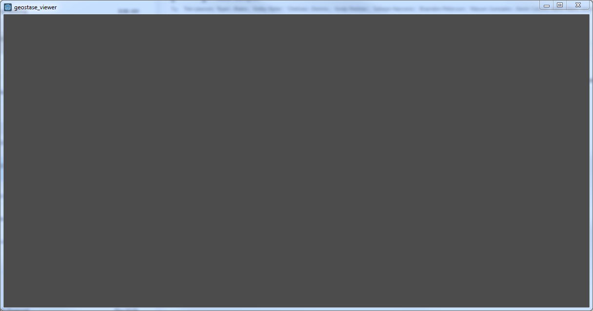
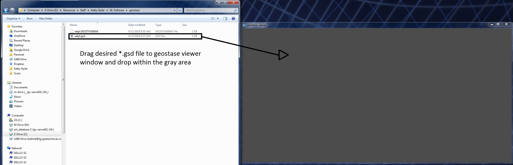
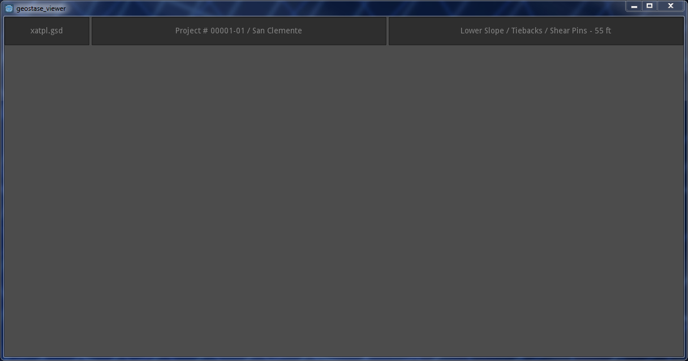
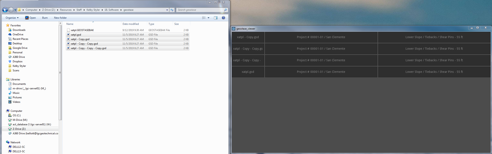

# geostase_viewer
View contents of *.gsd files without opening the program

Upon opening the tool you will see a blank grey screen. This is the area where the *.gsd file will be dragged to.

After dragging a *.gsd file into the viewer you will see the file name, project name, and project description.

Multiple files may be dragged into the window at once. Upon dragging a file into the window all existing project data will be removed from the window and be refereshed with only the most recently dragged items.

